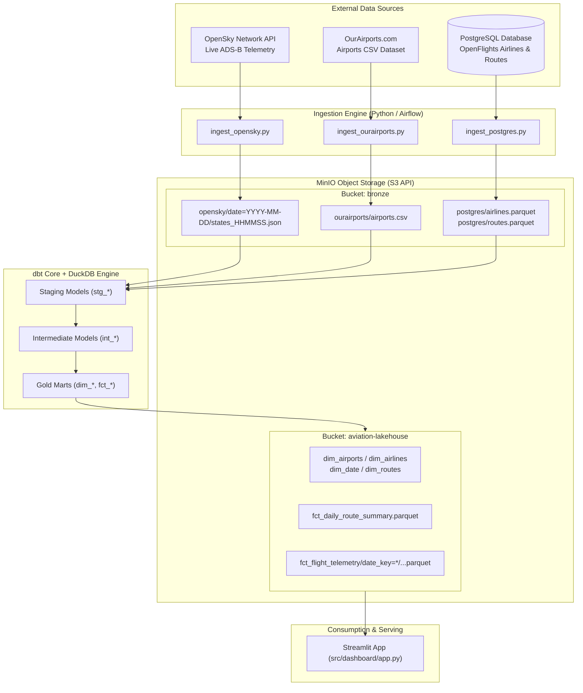
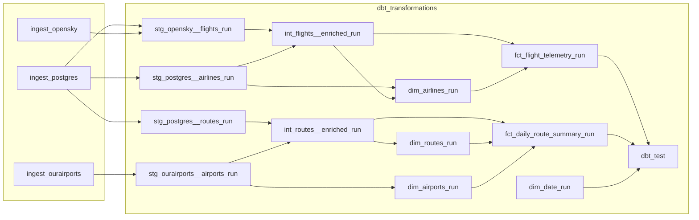
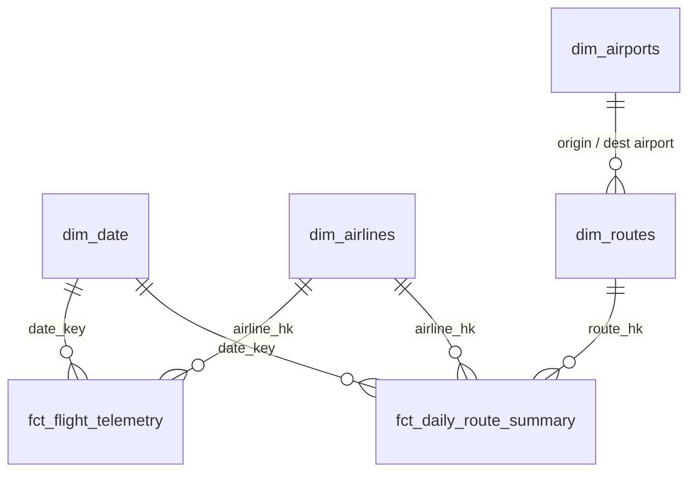

# Aviation Telemetry Lakehouse

An end-to-end Medallion Architecture (Bronze → Silver → Gold) Lakehouse that ingests live ADS-B flight telemetry, airport reference data, and airline/route data, models it into a Kimball star schema with dbt and DuckDB, and serves it through an interactive Streamlit dashboard .

---

## Architecture Overview

Three independent sources are ingested in parallel into a Bronze raw layer in MinIO:

- **OpenSky Network API** — live ADS-B state vectors (aircraft position, altitude, velocity, squawk codes)
- **OurAirports.com** — global airport geospatial and elevation reference data (CSV)
- **PostgreSQL** (seeded from OpenFlights) — airline identities and route topology

From there, dbt staging models clean and standardize each source individually, intermediate models handle shared enrichment (unit conversions, phase classification, route distance calculation) so logic isn't duplicated across marts, and Gold models write conformed dimensions and fact tables as Parquet directly back to MinIO. DuckDB does all the querying in-process via its `httpfs` extension.



### Orchestration

A single Airflow DAG (`aviation_lakehouse_pipeline`) runs hourly. The three ingestion tasks (`ingest_opensky`, `ingest_ourairports`, `ingest_postgres`) fan out in parallel, then feed into a dbt task group that compiles and runs the full dbt DAG inside an isolated virtual environment (`/opt/airflow/dbt_venv`). Tests run only after every model has built (`TestBehavior.AFTER_ALL`), so staging, intermediate, and Gold marts are validated together in one pass.



## Tech Stack

| Layer | Technology |
|---|---|
| Object Storage | MinIO (S3-Compatible) |
| Compute Engine | DuckDB (`httpfs`) |
| Data Transformation | dbt Core (dbt-duckdb) |
| Data Quality | dbt_utils, dbt_expectations |
| Orchestration | Apache Airflow 2.10 |
| Serving Layer | Streamlit |

### No Database, Just Object Storage + DuckDB

There's no data warehouse or OLTP database serving this platform — every layer (Bronze, Silver, Gold) is Parquet/JSON/CSV files sitting in MinIO. Postgres only exists as one of the three raw *sources* to ingest from (simulating a real operational system); it plays no role downstream. DuckDB is the only query engine in the stack: it reads and writes Parquet directly on object storage in-process via `httpfs`, dbt compiles all the modeling logic into DuckDB SQL, and the Streamlit dashboard queries the same Gold Parquet files straight off MinIO at read time. Nothing is copied into a server-based database at any point — storage and compute stay fully decoupled.

## Data Tier & Medallion Design

```mermaid
flowchart LR
    subgraph Bronze ["BRONZE (Raw Landing)"]
        direction TB
        B1["Raw JSON State Vectors"]
        B2["Raw Airports CSV"]
        B3["Raw Postgres Parquet Extracts"]
    end
    subgraph Silver ["SILVER (Cleaned & Enriched Views)"]
        direction TB
        S1["stg_opensky__flights<br/>stg_ourairports__airports<br/>stg_postgres__airlines<br/>stg_postgres__routes"]
        S2["int_flights__enriched<br/>(unit conversions, phase classification, squawk mapping)"]
        S3["int_routes__enriched<br/>(airport joins, great-circle Haversine distance)"]
    end
    subgraph Gold ["GOLD (Dimensional Parquet Lakehouse)"]
        direction TB
        G1[("dim_airports / dim_airlines<br/>dim_date / dim_routes")]
        G2[("fct_flight_telemetry<br/>(incremental, partitioned by date_key)")]
        G3[("fct_daily_route_summary<br/>(aggregated route KPIs)")]
    end
    Bronze --> Silver --> Gold
```



**Bronze (Raw Storage)** — bucket `bronze` in MinIO
- `opensky/date=YYYY-MM-DD/states_HHMMSS.json` — timestamped ADS-B transponder snapshots
- `ourairports/airports.csv` — global airfield points, runway elevations, ICAO/IATA identifiers
- `postgres/airlines.parquet`, `postgres/routes.parquet` — airline identity and route topology

**Silver (Quality, Typing & Enrichment)** — DuckDB in-memory views
- Staging (`stg_*`): deduplication (`dbt_utils.unique_combination_of_columns`), type casts, timestamp conversions, null filtering.
- `int_flights__enriched`: converts to nautical units (altitude in feet, speed in knots, climb/descent rate in fpm), maps squawk emergency codes (7500 unlawful interference, 7600 radio failure, 7700 emergency), and classifies flight phase (ground, climbing, descending, cruising, level_flight).
- `int_routes__enriched`: joins route endpoints to airports and computes great-circle Haversine distance (km) between origin and destination.

**Gold (Dimensional Data Marts)** — direct Parquet writes to `aviation-lakehouse/`
- *Core:* `dim_airports`, `dim_airlines` (surrogate hash key `airline_hk`), `dim_date` (2020–2030 calendar).
- *Commercial:* `dim_routes` (pre-joined origin/destination attributes), `fct_daily_route_summary` (daily corridor aggregates — distinct aircraft, avg cruise speed, operational counts).
- *Operations:* `fct_flight_telemetry` — high-frequency transponder state points, partitioned by `date_key`.

## Dimensional Data Model (Star Schema)



- **`fct_flight_telemetry`** — grain is one recorded transponder ping per aircraft timestamp. Materialized incrementally and partitioned by `date_key`, so new batches append instead of triggering a full-table refresh.
- **`fct_daily_route_summary`** — daily operational volume, speed, and altitude aggregates per route corridor.
- **`dim_airports`**, **`dim_airlines`**, **`dim_routes`**, **`dim_date`** — conformed dimensions joined across both fact tables.

## Project Structure

```
aviation-telemetry-lakehouse/
├── Dockerfile                         # Custom Airflow image with isolated dbt venv
├── docker-compose.yml                 # Multi-container local orchestration (Postgres, MinIO, Airflow)
├── requirements.txt                   # Host / development dependencies
│
├── dags/
│   └── aviation_lakehouse_pipeline.py # Master DAG: Ingestion -> dbt transformations
│
├── dbt/
│   ├── dbt_project.yml                # Project config, model paths, materialization rules
│   ├── packages.yml                   # dbt-utils, dbt-expectations
│   ├── profiles.yml                   # DuckDB adapter config, MinIO S3 credentials, Postgres attach
│   └── models/
│       ├── silver/
│       │   ├── staging/               # stg_opensky__flights, stg_ourairports__airports, ...
│       │   └── intermediate/          # int_flights__enriched, int_routes__enriched
│       └── gold/
│           └── marts/
│               ├── core/              # dim_airlines, dim_airports, dim_date
│               ├── commercial/        # dim_routes, fct_daily_route_summary
│               └── operations/        # fct_flight_telemetry
│
├── scripts/
│   ├── seed_postgres.py               # Seeds raw airlines and routes into PostgreSQL
│   └── query_postgres.py              # Debug utility to inspect PostgreSQL seed data
│
└── src/
    ├── ingestion/
    │   ├── ingest_opensky.py          # Live ADS-B states -> MinIO JSON
    │   ├── ingest_ourairports.py      # Airports dataset -> MinIO CSV
    │   └── ingest_postgres.py         # Airlines/routes -> MinIO Parquet
    ├── utils/
    │   ├── minio_client.py            # MinIO S3 client wrapper
    │   └── postgres_client.py         # PostgreSQL psycopg2 connection manager
    └── dashboard/
        └── app.py                     # Streamlit frontend with PyDeck & Altair
```

## Key Component Details
 
**Infrastructure (`docker-compose.yml`)**
- `aviation_postgres` (`5433:5432`) — source operational database (`aviation_db`) storing airline and route tables.
- `aviation_minio` (`9000` S3 API, `9001` Web Console) — Bronze and Gold lakehouse buckets.
- `airflow-postgres` — Airflow metadata store.
- `airflow-init` — initializes the metadata DB and provisions the admin user.
- `airflow-webserver` (`8085:8080`) — Airflow Web UI.
- `airflow-scheduler` & `airflow-triggerer` — executes pipelines and handles task dependencies.
 
| Service | Endpoint | Default Credentials | Purpose |
|---|---|---|---|
| Airflow Web UI | http://localhost:8085 | `admin` / `admin` | Orchestration & DAG runs |
| MinIO Console | http://localhost:9001 | `minioadmin` / `minioadmin` | Inspect Bronze / Gold buckets |
| MinIO S3 API | http://localhost:9000 | `minioadmin` / `minioadmin` | S3 endpoint for DuckDB `httpfs` |
| Operational DB | localhost:5433 | `postgres` / `postgres` (`aviation_db`) | OpenFlights source database |
| Streamlit App | http://localhost:8501 | None | 3D visualizer & BI dashboard |

**Interactive Dashboard (`src/dashboard/app.py`)**
- Queries Parquet directly from MinIO via in-memory DuckDB (`connect(":memory:")`) using S3 URI patterns, e.g. `s3://aviation-lakehouse/fct_flight_telemetry/*/*.parquet`.
- **Airspace Operations view:** 3D PyDeck visualization of aircraft positions, color-encoded by altitude (amber for low/approach, blue for cruise, purple for high); live KPIs (active aircraft, average altitude, max speed, emergency alerts); real-time flight table with carrier filtering, squawk decoding, and climb/descent indicators.
- **Commercial & Network Intelligence view:** global route corridor analysis (top-volume routes, great-circle distances), airport hub volume rankings, airline market share, fleet equipment distribution, and flight-phase operational profiles.
<table>
  <tr>
    <td></td>
    <td></td>
  </tr>
  <tr>
    <td></td>
    <td></td>
  </tr>
</table>

## Quickstart & Local Reproduction
 
**Prerequisites**
- Docker & Docker Compose
- Python 3.10+
**1. Start Infrastructure**
 
Spin up MinIO, PostgreSQL, and Apache Airflow:
 
```bash
docker compose up -d
```
 
**2. Install Dependencies**
 
```bash
pip install -r requirements.txt
```
 
**3. Seed the Postgres Source**
 
The Airflow DAG runs all three ingestion tasks automatically on its hourly schedule — the only manual step is seeding Postgres, which simulates the third raw source (airlines/routes reference data):
 
```bash
python scripts/seed_postgres.py
```
 
**4. Run dbt Transformations**
 
```bash
cd dbt
dbt deps
dbt build
```
 
**5. Launch the Telemetry Dashboard**
 
```bash
streamlit run src/dashboard/app.py
```
 
Access the application at `http://localhost:8501`.
 
